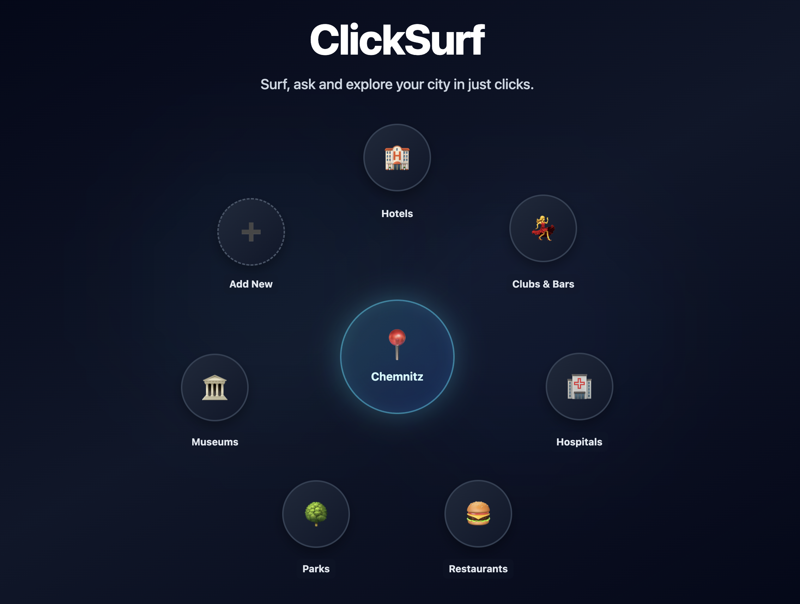
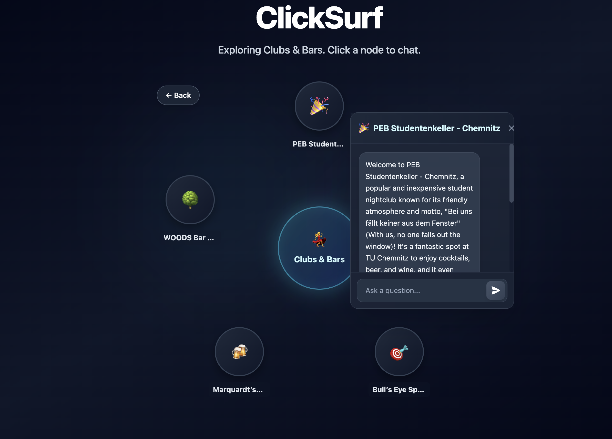

# ClickSurf

> **Surf, ask, and explore your city in just clicks.**

ClickSurf is an AI-powered location discovery app that helps you explore places around you through an interactive knowledge graph interface. Powered by Google's Gemini AI, it provides an intuitive way to discover and chat about local hotels, restaurants, parks, museums, nightlife, and more.

## 📸 Demo

<div align="center">

### 🎥 Video Walkthrough

**[Watch the Full Demo Video →](https://drive.google.com/file/d/1FTF2YrH2EbqtPpjWWsK-wvsvjlQzgRk5/view?usp=sharing)**

See ClickSurf in action with a complete walkthrough of all features!

---

### Home - Interactive Knowledge Graph



_Explore categories visually through an interactive circular knowledge graph. Click any category to discover nearby places._

---

### Discover & Chat with AI



_Click on any discovered place to open an AI-powered chat. Ask questions and get instant, intelligent responses about hours, amenities, directions, and more!_

</div>

## ✨ Features

- **📍 Location-Based Discovery**: Automatically detects your location to find nearby places
- **🎯 Interactive Knowledge Graph**: Visualize categories and places in an engaging circular graph layout
- **💬 AI-Powered Chat**: Ask questions about any place and get intelligent responses from Gemini AI
- **➕ Custom Categories**: Add your own custom categories to explore (e.g., "Coffee Shops", "Gyms", "Libraries")
- **🎨 Beautiful UI**: Modern, responsive design with smooth animations and gradients
- **🗺️ Smart Place Discovery**: Get detailed information including addresses, ratings, and directions

### Default Categories

- 🏨 **Hotels** - Find and ask about local hotels and lodging
- 💃 **Clubs & Bars** - Explore nightlife, clubs, and bars in the area
- 🏥 **Hospitals** - Get info on nearby hospitals and medical centers
- 🍔 **Restaurants** - Discover dining options and restaurant details
- 🌳 **Parks** - Find parks, trails, and recreational areas
- 🏛️ **Museums** - Learn about museums and cultural attractions

## 🚀 Getting Started

### Prerequisites

- **Node.js** (v18 or higher recommended)
- **Gemini API Key** - Get yours from [Google AI Studio](https://ai.google.dev/)

### Installation

1. **Clone the repository**

   ```bash
   git clone <repository-url>
   cd clicksurf-app
   ```

2. **Install dependencies**

   ```bash
   npm install
   ```

3. **Set up environment variables**

   Create a `.env.local` file in the root directory:

   ```bash
   VITE_GEMINI_API_KEY=your_gemini_api_key_here
   ```

4. **Run the development server**

   ```bash
   npm run dev
   ```

5. **Open your browser**

   Navigate to `http://localhost:5173` (or the port shown in your terminal)

### Building for Production

```bash
npm run build
```

The built files will be in the `dist/` directory.

To preview the production build locally:

```bash
npm run preview
```

## 🛠️ Technology Stack

- **Frontend Framework**: React 19 with TypeScript
- **Build Tool**: Vite
- **AI Integration**: Google Gemini AI (@google/genai)
- **Styling**: Tailwind CSS (utility-first)
- **Location Services**: Browser Geolocation API
- **State Management**: React Hooks (useState, useEffect)

## 📱 How to Use

1. **Grant Location Permission**: Allow the app to access your location when prompted
2. **Explore Categories**: Click on any category node (e.g., Restaurants, Parks) to discover nearby places
3. **Chat with Places**: Click on a discovered place to open an AI chat and ask questions
4. **Add Custom Categories**: Click the ➕ button to create your own discovery categories
5. **Remove Categories**: Hover over a category and click the ❌ to remove it
6. **Navigate Back**: Use the back button to return to the categories view

## 🌟 Features in Detail

### Knowledge Graph Visualization

- Dynamic circular layout with smooth animations
- Hover effects and interactive nodes
- Back navigation and remove buttons for enhanced UX

### AI-Powered Conversations

- Context-aware responses based on the place and category
- Get information about hours, amenities, directions, and more
- Persistent chat history during your session

### Responsive Design

- Works seamlessly on desktop, tablet, and mobile devices
- Adaptive layout and touch-friendly interactions

## 🔐 Privacy & Permissions

- **Location Data**: Used only to find nearby places, never stored or shared
- **API Keys**: Keep your Gemini API key secure in `.env.local` (never commit this file)
- **Geolocation**: Requires browser permission to access your location

## 📝 Project Structure

```
clicksurf-app/
├── components/          # React components
│   ├── KnowledgeGraph.tsx
│   ├── ChatTooltip.tsx
│   ├── AddCategoryModal.tsx
│   ├── ConfirmDeleteModal.tsx
│   ├── InfoModal.tsx
│   └── icons/          # SVG icon components
├── services/           # API and service integrations
│   └── geminiService.ts
├── types.ts           # TypeScript type definitions
├── App.tsx           # Main application component
└── index.tsx        # Application entry point
```

## 🤝 Contributing

Contributions are welcome! Feel free to open issues or submit pull requests.

## 📄 License

This project is open source and available under the MIT License.

## 🔗 Links

- View in AI Studio: https://ai.studio/apps/drive/1hbf5Zo-bYvkBleu0hyEgoXfflhyc1lRq
- Get Gemini API Key: https://ai.google.dev/

---

<div align="center">
Made with ❤️ from Chemnitz for Staffbase Hackathon!
</div>
